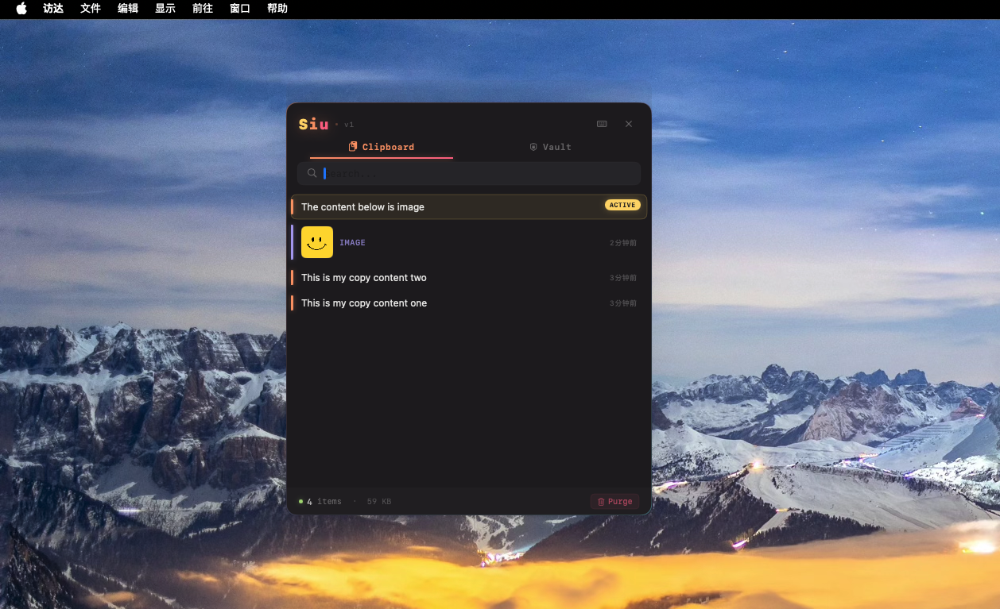
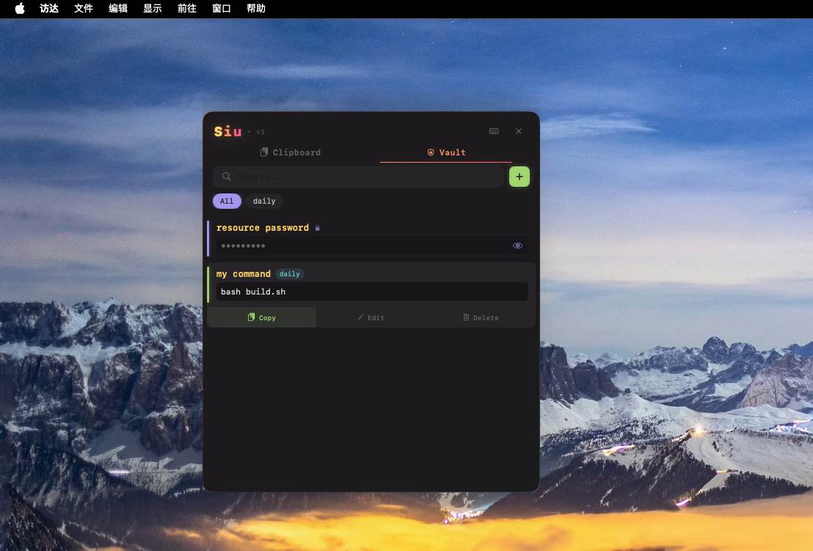

# Siu

A lightweight clipboard manager for macOS, built with Swift and SwiftUI.


## Screenshots

| Clipboard | Vault |
|:---------:|:-----:|
|  |  |

## Features

- **Clipboard History** — Automatically records text and image copies
- **Global Hotkey** — System-wide shortcut (default `⌘⇧V`) via Carbon API, works in any app
- **Pin Items** — Pin frequently used entries to the top
- **Search** — Quickly filter through clipboard history
- **Code Detection** — Auto-identifies code snippets with monospaced display
- **Current Highlight** — Highlights the item matching your current clipboard
- **Vault** — Save reusable snippets with tag grouping, encrypted entry support, and inline actions
- **Monokai Pro Theme** — Cyberpunk / HUD–inspired dark UI with glow accents
- **Menu Bar App** — Lives in the status bar, no Dock icon

## Install

### From DMG

Download `Siu.dmg` from [Releases](../../releases), open it, and drag `Siu.app` into `Applications`.

### Build from Source

```bash
cd Siu
bash build.sh
open Siu.dmg
```

Requires **Xcode Command Line Tools** and **macOS 14+**.

## Usage

1. Launch Siu — it appears as **"Siu"** in the menu bar
2. Press `⌘⇧V` (or click the menu bar icon) to open the clipboard panel
3. Click any item to copy it back to clipboard
4. Right-click for pin/delete options
5. Click the ⌨️ button in the panel to customize the hotkey

## Project Structure

```
Siu/
├── Package.swift
├── build.sh                  # Build script (app bundle + DMG)
└── Siu/
    ├── SiuApp.swift          # App entry, status bar setup
    ├── Controllers/          # Floating panel controller
    ├── Models/               # ClipboardItem, SnippetItem
    ├── Services/             # Clipboard monitor, storage, snippet vault, image manager
    ├── Utilities/            # HotKey (Carbon API), constants
    ├── Views/                # SwiftUI views (clipboard, vault, settings)
    └── Assets.xcassets/      # App icons
```

## License

MIT License. See [LICENSE](LICENSE) for details.
